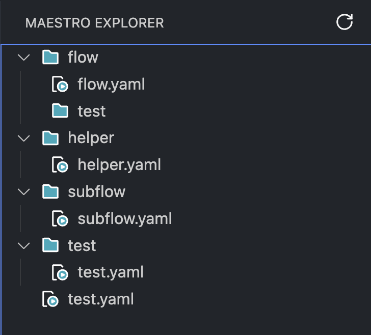

# Vscode Maestro extension

A Visual Studio Code extension designed to enhance productivity and reduce errors while developing Maestro tests.

Maestro simplifies testing your applications; vscode-maestro-extension simplifies writing Maestro scripts

# Table of Contents

- [Features](#features)
- [RoadMap](#roadmap)
- [Authors](#authors)
- [Snippets](#snippets)
- [Changelog](./CHANGELOG.md)

# How to use it ?

## Maestro Explorer

Firstly, create a 'maestro' or '.maestro' folder. The maestro-extension will detect it and set it as the root folder for the Tree View.

After this, you will be able to see all your YAML files and run them.

## Snippets

[Snippets table](#snippets)

## Features

- **TreeView**, you can see folders and Maestro files. However, other types of files are not displayed; please use the default explorer for those.
- Some **Snippets** see [Snippets](#snippets)

## Roadmap

- **A linter** with the purpose of identifying potential errors before even executing the script. For instance, it checks if the paths in runFlow are correct and whether the environment variables required by child scripts are properly provided.

- **A language grammar**, which would enable developers to know the parameters and available commands directly within Visual Studio Code, thus avoiding constant referencing to the official documentation

## Authors

- [@rouret](https://www.github.com/rouret)

## Snippets

## Command Prefixes and Descriptions

| Prefix                 | Description                                       |
| ---------------------- | ------------------------------------------------- |
| visible                | N/A                                               |
| notVisible             | N/A                                               |
| launchApp              | Command to launch the application.                |
| stopApp                | Command to stop the application.                  |
| appID                  | Command to get the application ID.                |
| name                   | Command to get the flow name.                     |
| id                     | Command to set an ID.                             |
| hepler                 | N/A                                               |
| subflow                | N/A                                               |
| flow                   | Template for a Maestro flow                       |
| tapOnById              | Command to tap on an element with an ID.          |
| runWhenCommand         | Command to run a flow when a command is executed. |
| assertTextVissible     | Command to assert that a text is visible.         |
| assertTextByIdVissible | Command to assert that a text is visible by ID.   |
| runFlow                | Command run a flow                                |
| runFlowWhen            | Command run a flow                                |
